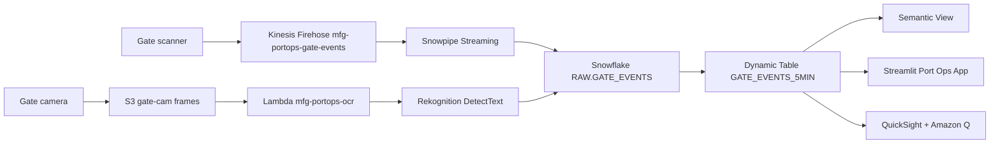

# Manufacturing Port Operations & Vessel Tracking

Real-time port operations intelligence powered by Snowflake Cortex AI — optimize berth allocation, reduce vessel wait times, and prevent terminal congestion.

## Architecture

A real-time terminal twin built on **Snowflake** (Snowpipe Streaming, Dynamic Tables, semantic view, Cortex Analyst) and **AWS** (Kinesis Data Firehose, S3, Lambda, Rekognition, QuickSight + Amazon Q). Every gate scan reaches Snowflake in under 5 seconds; gate-camera frames are read by Rekognition `DetectText` and joined to the event stream.




## Snowflake Capabilities

| Capability | Implementation |
|-----------|---------------|
| Dynamic Tables | TERMINAL_STATUS / VESSEL_TRACKING / BERTH_SCHEDULE / GATE_EVENTS |
| ML Functions | ML.FORECAST berth demand + ML.ANOMALY_DETECTION vessel delays |
| Cortex Search | 80 port regulation documents indexed |
| Cortex Agent | PortOpsAnalyst + RegulationSearch tools |
| Semantic View | Structured analytics over terminals, vessels, berth operations |
| Streamlit | Multi-page dashboard: Overview / Terminal / Vessel / Berth / Ask |

## AWS Services

| Service | Role in Demo |
|---------|-------------|
| Amazon S3 | Gate camera images and port data feeds |
| Amazon Kinesis Firehose | Real-time gate event streaming |
| AWS Lambda | OCR processing via Rekognition for container IDs |
| Amazon QuickSight | Executive port operations dashboard |
| Amazon Q | Natural language analytics for Port Director |

## Personas

| Persona | Role | Key Questions |
|---------|------|---------------|
| **Captain Liu Wei** | Port Authority Director | Which terminals are over capacity? Where do I reroute? |
| **Rachel Torres** | Maritime Operations VP | What's our throughput? Are we meeting SLAs? |

## Data

| Table | Rows | Description |
|-------|------|-------------|
| VESSELS | 200 | Active vessel fleet with status and cargo |
| TERMINALS | 8 | Terminal capacity and current assignments |
| BERTH_ASSIGNMENTS | 5,032 | Historical and active berth allocations |
| PORT_EVENTS | 50,000 | Operational events (arrivals, departures, delays) |
| CARGO_MANIFESTS | 20,001 | Cargo detail per vessel |
| PORT_REGULATIONS | 80 | Maritime rules and procedures |

## Build Instructions

### Prerequisites
- Snowflake account with ACCOUNTADMIN access
- Cortex AI enabled (ML Functions, Search, Agent)
- Warehouse: CORTEX (Medium)

### Deployment

```bash
snowsql -f snowflake/00_setup.sql
snowsql -f snowflake/01_raw_tables.sql
snowsql -f snowflake/02_staging.sql
snowsql -f snowflake/03_dynamic_tables.sql
snowsql -f snowflake/04_search.sql
snowsql -f snowflake/05_ml_models.sql
snowsql -f snowflake/06_semantic_view.sql
snowsql -f snowflake/07_agent.sql
```

### Streamlit App
```
MANUFACTURING_PORT_OPS.APP.PORT_OPERATIONS_APP
```

## Build Modes

### Snowflake Only
Run the SQL scripts in `snowflake/` (skip Kinesis/Lambda integration) and deploy the Streamlit app from `streamlit/deploy/`. Uses Cortex AI for all analytics, Snowflake Intelligence instead of QuickSight.

### Full AWS + Snowflake
Run all SQL scripts including gate event streaming. Deploy the main Streamlit app from `streamlit/`, then run QuickSight setup from `quicksight/`.

## Business Impact

Industry research and Snowflake customer outcomes:
- **Port terminal congestion** adds $600-$1200 per container in demurrage -- World Shipping Council
- **Real-time vessel tracking** reduces port wait times by 25-40% -- McKinsey Maritime
- **Automated gate operations** improve throughput by 30% -- Port Technology International
- **BMW Group** saved 25% on large data workloads and launched 60 use cases in 18 months on Snowflake -- [snowflake.com/customers/bmw-group](https://www.snowflake.com/en/customers/all-customers/case-study/bmw-group/)
- **Penske Logistics** consolidated all supply chain performance data on Snowflake, enabling 5-year trend analysis in 15 minutes -- [snowflake.com/customers/penske](https://www.snowflake.com/en/customers/all-customers/case-study/penske/)

## Key Demo Numbers

- **8 vessels** queued at Terminal 3 (capacity: 5)
- **18h** average wait time at Terminal 3 (target: 4h)
- **MV Pacific Star** — 22h waiting, $85M cargo
- **Terminal 1** — 2 free berths, ready to absorb rerouted traffic
- **4 vessels** recommended for rerouting

## License

Apache 2.0 — See [LICENSE](LICENSE) for details.

This is a personal demo project and is not an official Snowflake offering. It comes with no support or warranty. Industry metrics cited are from publicly available third-party research and Snowflake customer stories; they represent reported outcomes and are not guarantees of results.
